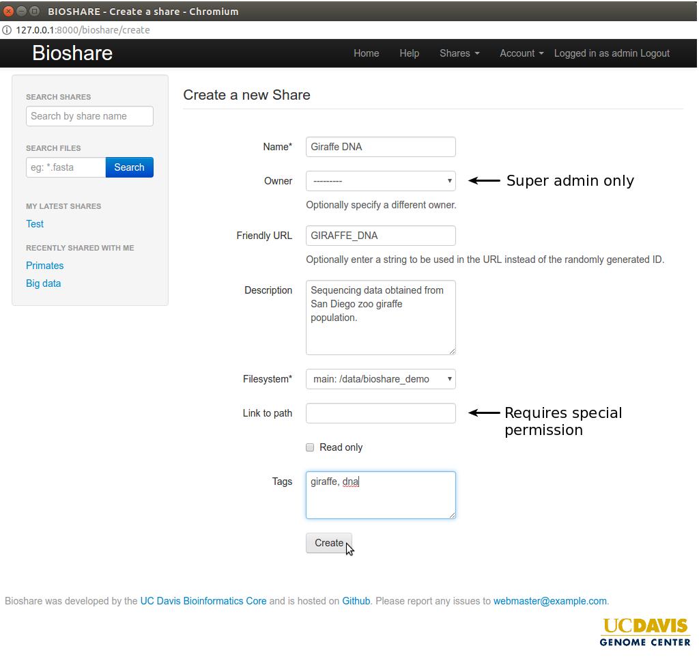

Creating a share
================
If you have permission to create a share (not all users have permission - many users are just collaborators), it only requires filling out a few mandatory fields.  To create a share, from the navigation bar go to "Share -> Create".  A description of the process is below:

**Name (required)**: Enter a name for the share.  A meaningful name will make it easier to search for.  
**Owner (super admin only)**: A super admin can assign ownership of the share to another user.  
**Friendly URL**:  Optionally add a text string to use instead of the random ID in places.  This will show up in some URLs, as well as the directory listing for SFTP.  
**Description**:  Optional.  
**Filesystem (required)**:  Choose which filesystem to create the share on.  Bioshare supports multiple filesystems or mount points.  
**Link to path (requires special permission)**:  It is possible to link to an existing directory on the server.  For obvious reasons, this permission is restricted.  Additionally, the directoy must fall under a whitelist configured in the config.py file.  
**Read only**:  If selected, writing and deleting from the share will be disabled.  Usually this would only be selected when modifying the share after it already contains data.  
**Tags**:  Optionally catagorize the share by listing comma seperated tags.  
