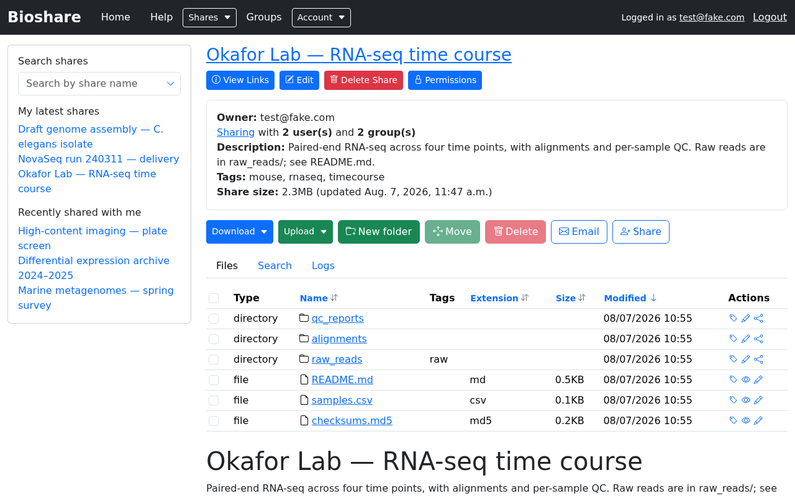
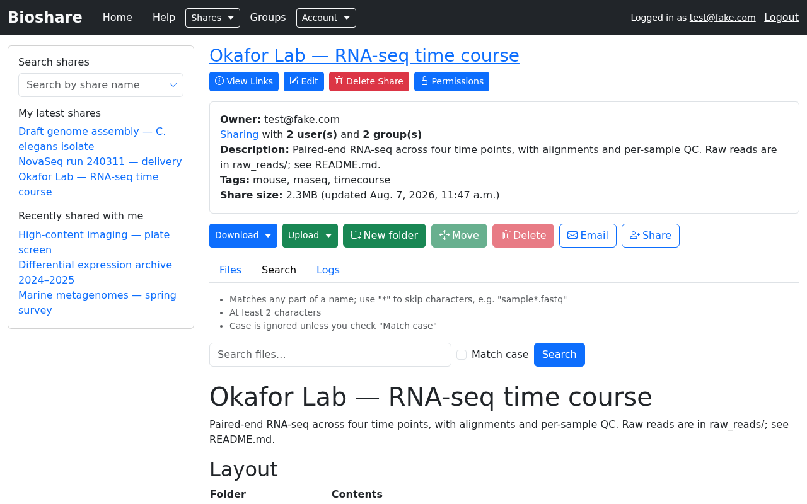
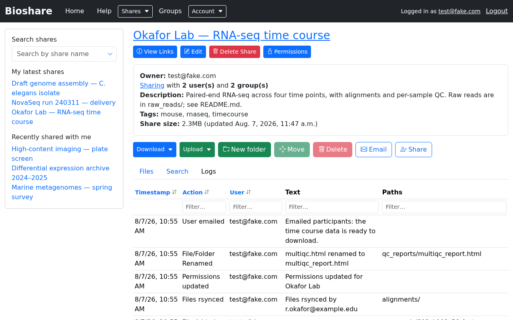

# Browsing a share

Opening a share from the home page or the sidebar brings you to its main
interface. This is where you view, search, transfer and organise files.

## Share information

At the top is the share's name, and — when you are inside a subfolder — the path
you have navigated into. Every part of that path is a link, so you can jump back
to any level.

The panel beneath it summarises the share:

| Field | Meaning |
|---|---|
| **Owner** | Who created the share and is ultimately responsible for it |
| **Sharing** | How many users and groups have access. Click **Sharing** to see them |
| **Description** | Free text set by the owner |
| **Tags** | Labels used to categorise and find the share |
| **Share size** | Total size, with the time it was calculated. It is not recomputed on every visit — see [Storage used](managing-shares.md#storage-used) |

## The file list

The **Files** tab lists everything in the current folder. Alongside each name are
its type, tags, extension, size and modification time.

- Click a **folder** name to move into it.
- Click a **file** name to download it.
- Sort by clicking any column header; filter using the box above the list.
- Tick the checkbox beside one or more entries to act on them in bulk.

### Rendered README

If a share contains a file called `README.md` at the level you are viewing, its
contents are rendered directly beneath the file list. This is a good place for a
share owner to explain how the data is organised, what the samples are, or how the
files were produced — the reader sees it without downloading anything.

When no such file exists, BioShare shows a short hint saying you can add one.

## Actions on the whole folder

The buttons above the file list act on the current folder, or on whatever you have
ticked:

| Button | What it does |
|---|---|
| **Download** | Retrieve several files or folders at once — see [Downloading and uploading](transfers.md) |
| **Upload** | Add files, by browser, SFTP or rsync |
| **New folder** | Create a folder in the current location |
| **Move** | Move the selected entries elsewhere *within the same share* |
| **Delete** | Permanently delete the selected entries |
| **Email** | Email the people who have access to this share |
| **Share** | Share the current folder onward — see [read-only sharing](#sharing-a-folder-read-only) |

!!! warning "Naming restrictions"

    File and folder names may contain only letters, numbers, periods, underscores
    and dashes. Names with spaces or other characters are rejected.

## Actions on a single file

The **Actions** column at the right of each row offers a few icons, and which ones
appear depends on whether the row is a file or a folder:

| Action | Files | Folders |
|---|---|---|
| **Add or edit metadata** — attach notes and comma-separated tags to that entry. Tags appear in the Tags column and are searchable | ✓ | ✓ |
| **Rename** — change the name, subject to the naming restrictions above | ✓ | ✓ |
| **Preview** — view the contents in the browser without downloading. Useful for a small text, CSV or report file | ✓ | |
| **Create subshare** *(share owner only)* — turn the folder into a share in its own right. See [Subshares](creating-shares.md#subshares) | | ✓ |

### Checksums

BioShare can calculate an **md5sum** for a file. Compare it against the checksum of
your downloaded copy to confirm the transfer was not corrupted — worth doing after
a large or interrupted download.

## Searching within a share

The **Search** tab searches the files inside this share, rather than the list of
shares.

Enter part of a filename to see matching files anywhere in the share, including
inside subfolders. The rules are listed above the box, and are worth knowing:

- **Any part of the name matches** — searching `fastq` finds `S01_L001_R1.fastq.gz`.
  There is no need to add wildcards around your term.
- **`*` skips characters** within the term, so `sample*.fastq` matches
  `sample01_R1.fastq` but not `other_sample.fastq`.
- **At least two characters** are required. Shorter queries would match most of a
  share and are rejected rather than served slowly.
- **Case is ignored** unless you tick **Match case**.

Results are capped (50 by default), and you are told when there are more. If what
you want is not listed, make the term more specific rather than scrolling.

Folders and files are both returned; clicking a folder opens it, clicking a file
downloads it.

## Activity log

The **Logs** tab shows what has happened to the share: files added, folders
created, entries renamed, moved or deleted, rsync transfers, and permission
changes.

This is useful for answering "has the data finished uploading?" or "who deleted
that folder?". Shares with no recorded activity show a short message instead.

## Symlinks

If a share contains symbolic links, the owner can review them through **View
Links**. Only the share's owner may see this — it shows where each link points, so
that links escaping the share can be spotted and removed.

## Sharing a folder read-only

The **Share** button offers a way to pass a folder on to someone else with
read-only access, without granting them any ability to change the data. This
corresponds to the **Share** column on the
[permissions matrix](permissions.md#what-each-permission-allows).
