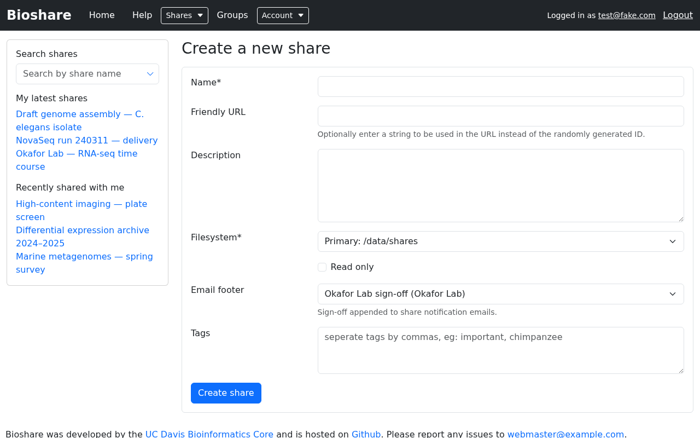

# Creating shares

Not everyone can create shares — many accounts exist purely so that data can be
shared *with* them. If you do have permission, choose **Shares → Create** from the
navigation bar.

## The form

| Field | Notes |
|---|---|
| **Name** *(required)* | Choose something meaningful. This is what people search for and what appears in their share list |
| **Friendly URL** | An optional text string used in place of the random ID. It shows up in URLs and as the directory name in SFTP listings, which makes command line work much more pleasant |
| **Description** | Optional free text explaining what the data is |
| **Filesystem** *(required)* | Which storage volume to create the share on. It defaults to blank, so you must choose one |
| **Read only** | Disables writing and deleting for everyone. Most often applied later, once a share is populated |
| **Tags** | Comma-separated labels for categorising the share |

!!! warning "Tags must be alphanumeric"

    Tags are validated as comma-separated alphanumeric words. `rnaseq` is fine;
    `rna-seq` is rejected because of the hyphen.

Some fields only appear if you have the corresponding permission:

- **Owner** — administrators can create a share on someone else's behalf.
- **Link to path** — points a share at a directory that already exists on the
  server, instead of creating a new empty one. This is restricted, and the target
  must fall inside a whitelist configured by your administrator. The form lists the
  permitted locations.

## After creating

A new share is empty and shared with nobody. Two things usually follow:

1. **Add data** — see [Downloading and uploading](transfers.md).
2. **Give people access** — see [Permissions](permissions.md). Until you do, you
   are the only person who can see it.

Adding a `README.md` file at the top of the share is worth the small effort:
BioShare renders it underneath the file list, so anyone opening the share sees your
explanation of the contents without downloading anything. See
[Rendered README](browsing-shares.md#rendered-readme).

## Read-only shares

Ticking **Read only** blocks all writing and deleting, regardless of individual
permissions. It is most useful once a dataset is final: it protects the data from
accidental modification by people who still need to download it.

You can toggle this later from the share's **Edit** form, so there is no need to
decide up front.

## Subshares

You can also create a share from a folder *inside* an existing share. Open the
share, find the folder, and choose **Create subshare** from its Actions column.

A subshare is a view of the same underlying directory rather than a copy:

- Files added or removed through either share are visible in both, because there is
  only one set of files.
- Permissions are separate. Access granted on the subshare applies only to what is
  reachable from that folder down.

This is the tool for "I want to give this collaborator that one directory, and
nothing else."
