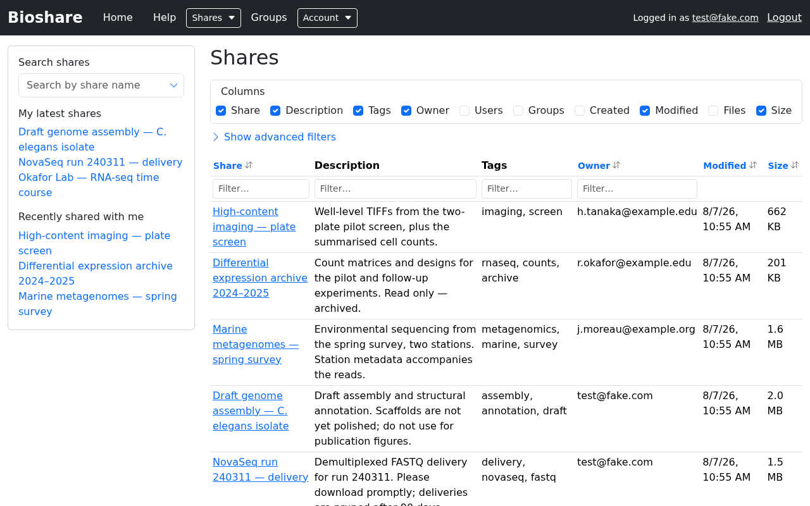

# Getting started

## Logging in

Go to your institution's BioShare address and sign in with **your email address**
and password. The login form labels the first field "Email" for that reason — there
is no separate username.

If you have never used BioShare before, you do not need to register. When someone
shares data with you, an account is created and you are emailed a link along with
your initial credentials. If you no longer have them, use the **Forgot password?
Reset it** link on the login page.

!!! tip "Repeated failed logins are throttled"

    Sign-in attempts are rate limited. If you get the password wrong several times
    in a row you will be locked out briefly — wait rather than continuing to retry.

## The home page

After logging in you land on the list of every share you can see: both shares you
own and shares other people have shared with you.

### Choosing columns

The **Columns** panel above the table controls which fields are displayed. Tick or
untick any of Share, Description, Tags, Owner, Users, Groups, Created, Modified,
Files and Size. Your choice persists as you move around the table.

### Sorting and filtering

- **Sort** by clicking a column header. Click it again to reverse the direction.
- **Filter** by typing into the box beneath a column header. The table updates as
  you type, and filters on different columns combine.
- **Show advanced filters** opens additional criteria for narrowing the list
  further.

If a filter matches more results than fit on one page, the table is paginated and
the total is shown beneath it.

## The sidebar

The sidebar appears on every page once you are logged in.

- **Search shares** — start typing a share name and matching shares are suggested.
- **My latest shares** — shares you created most recently.
- **Recently shared with me** — shares other people have given you access to.

Entries are shown in red with a warning icon when there is a problem with the
share, for example when the folder behind it can no longer be found on the server.
Hover over the entry to see why.

## Finding a specific file

To search *inside* a share rather than across the share list, open the share and
use its **Search** tab — see [Browsing a share](browsing-shares.md#searching-within-a-share).

## Where to go next

- Open a share and work with its files: [Browsing a share](browsing-shares.md)
- Move data in or out in bulk: [Downloading and uploading](transfers.md)
