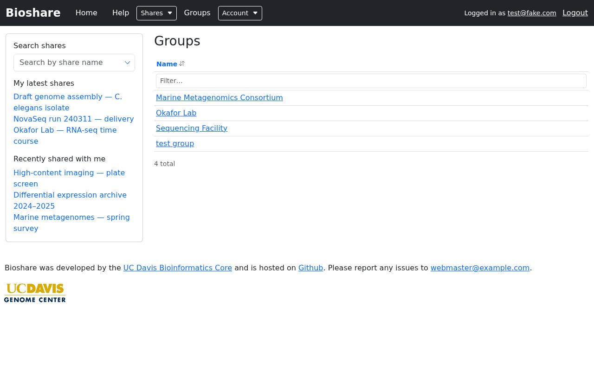

# Groups

A group is a named set of people. Granting a group access to a share gives every
member that access, and membership changes take effect immediately — nobody has to
revisit the share's permissions.

Groups are worth using when the same set of people needs access to many shares: a
lab, a project team, or a sequencing facility's staff.

## Finding groups

**Groups** in the navigation bar lists the groups you belong to or administer. Sort
by clicking the **Name** header, or narrow a long list with the filter box. Click a
group's name to open it.

Opening a group shows the shares associated with it, so it doubles as a view of
"everything this team has access to".

## Managing a group

From a group you administer you can review and change its membership, and edit the
group's name and description.

Whether you can **create** a new group, and whether you can administer an existing
one, depends on the permissions your account has been given. If the options
described here are not visible to you, ask whoever administers your BioShare
instance — group creation is often restricted.

## Sharing with a group

On a share's [permissions page](permissions.md#granting-access), pick the group from
**Add a user or group** exactly as you would pick a person, tick the permissions it
should have, and click **Update permissions**.

Every member then receives those permissions. Someone who is both a member of the
group *and* listed individually gets the more permissive of the two.

!!! tip "Prefer groups over long lists of individuals"

    A share granted to a group stays correct as people join and leave the team. A
    share granted to fifteen named individuals has to be revisited every time
    somebody moves on — and is usually forgotten, leaving access in place longer
    than intended.

## Group-owned shares

A share can belong to a group rather than to one person. This matters for
continuity: when a share is owned by an individual who leaves, responsibility for it
becomes unclear, whereas a group-owned share remains under the group's control.

Where your instance allows it, a share can be created directly against a group from
the group's own page.

## Email footers

Instances that use email footers can attach a default one to a group, so that
notifications about that group's shares carry a consistent sign-off identifying the
lab or facility. Individual shares can override it on their create or edit form —
see [Permissions](permissions.md#email-notifications).
