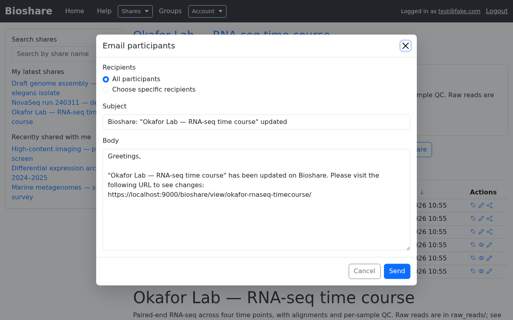

# Managing shares

Day-to-day upkeep of a share you own. All of these are reached from the buttons at
the top right of the share.

## Editing share details

**Edit** opens the same form used when [creating a share](creating-shares.md),
populated with the current values. Name, friendly URL, description, tags, the
read-only flag and the email footer can all be changed after the fact.

Changing the **friendly URL** changes the URLs people use to reach the share, and
the directory name they see over SFTP. Any links you have already sent out will
stop working, so avoid it once a share is in circulation.

## Storage used

The share information panel shows **Share size**, but it is not recalculated on
every page load — that would be expensive on a large share. Click **Update** beside
it to compute the current figure.

The home page also reports your overall storage. That total comes from statistics
refreshed on a schedule rather than live, so it can lag recent uploads; the note
beneath it says how often.

## The activity log

The **Logs** tab records what has happened to the share.

Each entry records a **Timestamp**, the **Action**, the **User** responsible, free
text describing what happened, and the **Paths** affected. Sort by clicking a
column header, and narrow a busy log with the filter boxes — filtering on Paths is
the quickest way to answer "what happened to this folder?".

Logged actions include files being added, folders created, entries renamed, moved or
deleted, symbolic links created or removed, rsync transfers, permission changes,
emails sent to participants, and errors.

Two things this answers well:

- **"Has the upload finished?"** — a long rsync or SFTP transfer shows up here as it
  progresses.
- **"What happened to that folder?"** — deletions, moves and renames are attributed
  and timestamped.

## Emailing participants

**Email** opens a dialog for messaging the people who have access to the share.

Choose **All participants**, or **Choose specific recipients** to pick individuals.
The subject and body are pre-filled with the share's name and a direct link to it,
so in the common case — "the data is ready" — you can send without typing anything.
Edit the body freely; the link is just text.

This is the tidy way to notify collaborators without assembling an address list by
hand, and it guarantees the recipients are exactly the people who can actually open
the share.

Messages sent this way are recorded in the activity log as **User emailed**.

## Symbolic links

If a share contains symlinks, **View Links** lists them and where each one points.
Only the share's owner may view this page.

It matters because a symlink can point outside the share — at another part of the
server's filesystem. Reviewing the list lets you spot and remove links that would
expose more than you intended.

## Deleting a share

**Delete Share** removes the share **and its contents**. You are asked to confirm
first.

!!! danger "Deletion is permanent"

    Files removed with the share are not recoverable through BioShare. If the data
    might still be wanted, consider marking the share read-only instead, or move the
    data elsewhere first.

Deleting a share that has [subshares](creating-shares.md#subshares) affects the
directories they point at, since they are all views of the same files.
