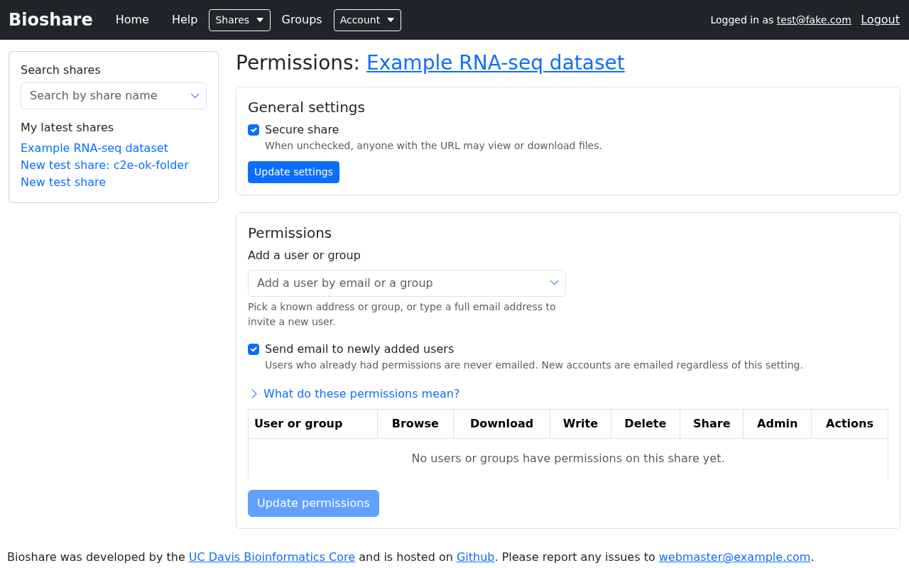

# Permissions

Anyone with **Admin** rights on a share can control who reaches it and what they
may do. Open the share and click **Permissions**.

## Secure share

The **Secure share** checkbox under General settings decides whether authentication
is required at all:

- **Checked** — visitors must log in, and must appear in the permission list below
  with at least Browse and Download, to see anything.
- **Unchecked** — anyone who has the URL can view and download the files.

Writing, deleting and administering *always* require a login and the matching
permission, whatever this setting says. Secure share governs read access only.

This setting has its own **Update settings** button, separate from the permission
table's.

!!! warning "Unchecking this makes the data public to anyone with the link"

    The URL is long and random, but it is not a secret — it travels in emails,
    browser history and server logs. Leave Secure share on for anything sensitive.

## Granting access

Use **Add a user or group** to pick someone. You can:

- Choose a known address or group from the suggestions, or
- Type a **full email address** to invite somebody who has no account yet. An
  account is created for them and they are emailed their credentials.

To share with a group rather than an individual, select the group from the same
box. Groups are covered in [Groups](groups.md).

!!! important "Adding somebody does not yet grant them anything"

    A newly added row appears in the table with no permissions ticked. Tick the
    boxes you want, then click **Update permissions**. Nothing takes effect until
    you do — this catches people out regularly.

    Rows with unsaved changes are highlighted. After a successful save the
    highlighting clears and a confirmation appears.

## What each permission allows

Each row in the table is one user or group, and each column is one permission:

| Column | What it allows |
|---|---|
| **Browse** | See that the share and its files exist. Required for everything else — without it the rest have no effect |
| **Download** | Retrieve files. Combined with Browse, this also enables SFTP and rsync downloads |
| **Write** | Create, upload and rename files and folders |
| **Delete** | Remove files and folders. Also required, alongside Write, to upload by rsync |
| **Share** | Pass the share on to other people read-only, without granting any ability to change the data |
| **Admin** | Everything above, plus editing the share and changing these permissions |

Two combinations are worth remembering:

- **Browse + Download** is what a typical collaborator receiving data needs.
- **Write + Delete** together are what an rsync upload needs — Write alone will
  fail with a `cannot write to share` error.

## Email notifications

**Send email to newly added users** controls whether people you add are told about
it. The message contains a link to the share.

Two details are easy to miss:

- People who *already* had permissions are never emailed, even when you change what
  they can do.
- Brand new accounts are emailed regardless of this checkbox, because otherwise
  they would never receive their credentials.

If your instance defines email footers, a share can carry one — a standard sign-off
appended to these notifications, usually identifying the group or facility sending
the data. Pick one on the share's create or edit form.

## Removing access

Use the **Actions** column to remove a user or group from the list, then click
**Update permissions** to apply it — the same two-step rule as granting.
