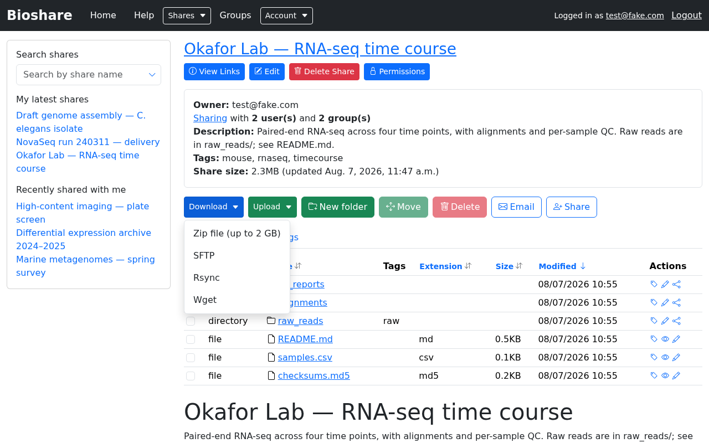
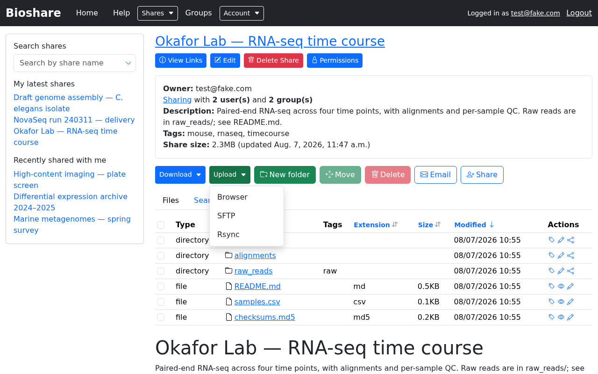
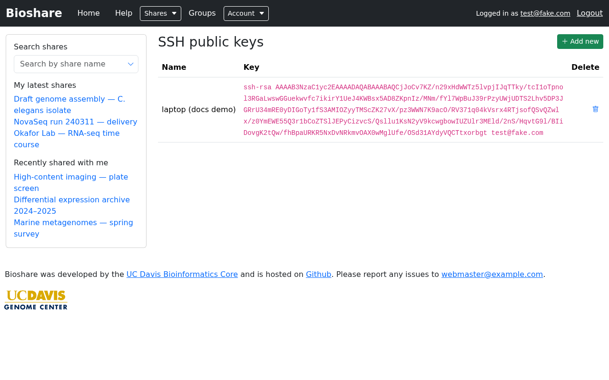

# Downloading and uploading

There are several ways to move data in and out of BioShare. The browser is
simplest, but for large or numerous files, command line tools are far more
reliable.

!!! tip "BioShare writes the commands for you"

    You do not need to assemble SFTP or rsync commands by hand. Open a share, click
    **Download** or **Upload**, and pick a method: BioShare shows the exact command
    for *that* share and folder, already filled in with the right host, port,
    username and path. Copy it and run it. The examples below are for explanation —
    always prefer the command the application gives you.

## Choosing a method

| Method | Good for | Direction |
|---|---|---|
| **Browser** | A handful of files; anything up to a couple of gigabytes | Both |
| **Zip file** | Grabbing a whole folder at once, up to 2 GB | Download |
| **SFTP** | Large transfers; graphical clients; no key setup needed | Both |
| **Rsync** | Very large or repeated transfers; resuming; syncing | Both |
| **Wget** | Recursive download on a machine where you cannot set up keys | Download |

Two situations make the browser a poor choice:

- **Large or numerous files.** Browsers cope badly with interruptions, and picking
  up where a failed download left off is difficult.
- **Transferring to another server.** Downloading to your laptop only to upload
  again to a cluster wastes time and bandwidth. Instead, log in to the destination
  machine and pull the data directly with rsync, SFTP or wget.

## Using the browser



To **download**, click a file's name. To take several at once, tick them and choose
**Download → Zip file**. BioShare builds the archive as it streams, so the download
starts promptly, but the total is capped at 2 GB — above that, use one of the
command line methods.

To **upload**, choose **Upload → Browser**. A drop area appears: either select files
or drag them onto it. Uploading starts immediately; there is no separate confirm
step.



## SFTP

SFTP is a cross-platform standard for secure file transfer, available as both
graphical and command line tools, and it supports uploads and downloads. It
authenticates with **the same email address and password you log in with** — no key
setup required, which makes it the easiest of the command line options.

### Graphical clients

[FileZilla](https://filezilla-project.org) is free, open source, and available on
Windows, macOS and Linux. Others such as Cyberduck work too, but are not on every
platform.

Use the Quickconnect bar at the top of the FileZilla window:

| Field | Value |
|---|---|
| Host | `sftp://` followed by your BioShare server's address |
| Username | Your BioShare email address |
| Password | Your BioShare password |
| Port | As shown in BioShare's SFTP dialog — it is not the default 22 |

After connecting, your available shares are listed on the remote side, and you can
drag files between there and your machine.

### Command line

```shell
sftp -P 2200 'joe@bigdata.org'@bioshare.example.org
```

The port and host will differ — take them from BioShare's SFTP dialog. Note the
quoting: the username is an email address containing an `@`, so it must be quoted
before the `@host` part.

Once connected:

| Command | Effect |
|---|---|
| `ls` | List your shares. A share with a friendly URL appears under that name |
| `cd DIRECTORY` | Enter a directory |
| `get FILENAME` | Download a file |
| `get -r DIRECTORY` | Download a directory |
| `put /local/path/file` | Upload a file |
| `put -r /local/path/dir` | Upload a directory |

See the [sftp manual](https://man.openbsd.org/sftp) for more.

## Rsync

Rsync is the most efficient option for large datasets. It transfers only what has
changed, so re-running it after a partial or interrupted transfer costs little —
which matters when a dataset is regularly updated.

It is also the most involved to set up. Unlike SFTP, rsync cannot use your password:
it authenticates with an **SSH key pair**. Rsync on Windows is possible but not
recommended.

### Setting up an SSH key

BioShare uses SSH keys much as GitHub does; GitHub's
[guide to connecting with SSH](https://docs.github.com/en/authentication/connecting-to-github-with-ssh)
is worth reading.

**1. Check whether you already have a key**

```shell
ls -al ~/.ssh
```

Look for `id_rsa` and `id_rsa.pub` — your private and public key. If they exist,
skip to step 3.

**2. Create one if not**

```shell
ssh-keygen -t rsa -b 4096 -C "your_email@example.com"
```

Set a passphrase when prompted. You will enter it when using the key, which is what
keeps it secure if the file is ever copied.

**3. Upload the public key**

Go to **Account → SSH Keys**. Any keys you have already uploaded are listed, and can
be deleted from here.



Click **Add new**, give the key a name that will remind you which machine it came
from, and select the **public** key — `id_rsa.pub`, not `id_rsa`.

!!! warning "Upload the `.pub` file only"

    The file *without* the `.pub` extension is your private key. It should never
    leave your machine and never be uploaded anywhere.

    If the file picker will not show your `.ssh` folder, it is probably hiding
    dot-directories. Copy `id_rsa.pub` somewhere more convenient and upload it
    from there.

### Transferring

To download a share to your machine:

```shell
rsync -vrt bioshare@bioshare.example.org:/RANDOM_SHARE_ID/ /to/my/local/directory
```

To upload:

```shell
rsync -vrt --no-p --no-g --chmod=ugo=rwX /path/to/my/files bioshare@bioshare.example.org:/RANDOM_SHARE_ID/
```

The `--no-p --no-g --chmod=ugo=rwX` flags are not optional for uploads: they stop
rsync trying to reproduce your local ownership and permissions on the server, which
it is not allowed to do.

!!! note "Uploading by rsync needs Write **and** Delete"

    Rsync requires both permissions to upload, because of how it replaces files
    during a transfer. Write on its own is not enough — see
    [Permissions](permissions.md).

## Wget

Wget recursively downloads a share over HTTPS using your current browser session,
which means there is no key setup — but the transfer only works while that session
remains valid, so it suits medium-sized downloads rather than multi-day ones.
BioShare generates the full command, including the session cookie, under
**Download → Wget**, with variants for Linux/macOS and Windows.

## Troubleshooting rsync

### It asks for a password and fails to authenticate

If your key is set up correctly, BioShare will not ask for a password. Check, in
order:

**Is the private key on the machine you are running rsync from?** A common mistake
is to SSH into a server and rsync from there — the key is on your laptop, not on
that server. Either copy the private key to `~/.ssh/` on that machine, or run rsync
from the machine that has it. After copying:

```shell
ssh-add ~/.ssh/id_rsa
```

**Is the SSH agent running?**

```shell
ssh-add -L
```

If that reports `Could not open a connection to your authentication agent.`, start
it and add the key:

```shell
eval "$(ssh-agent -s)"
ssh-add ~/.ssh/id_rsa
```

**Are you offering the right key?** Compare the output of `ssh-add -L` against the
keys listed on your **Account → SSH Keys** page. If the one you uploaded is not
loaded, add it with `ssh-add`.

### `handle_rsync exception: User ... cannot read from share`

You do not have permission to download from the share. Ask the owner or an
administrator for **Download** permission.

### `handle_rsync exception: User ... cannot write to share`

You do not have permission to upload by rsync. Ask for both **Write** and **Delete**
— rsync needs both.
