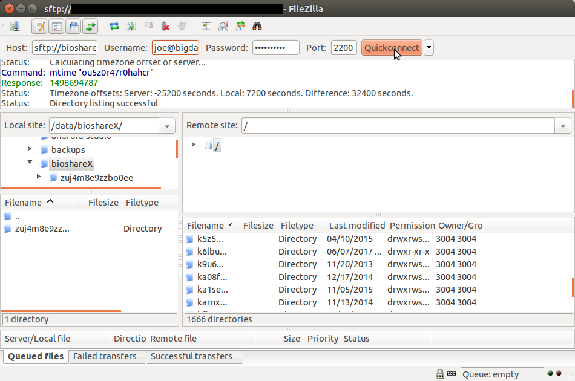

Downloading/Uploading
=====================

There are multiple ways to download or upload files within Bioshare.  The simplest is generally by using the browser.  Here, files can simply be downloaded by clicking on a link, or by selecting a list of files and directories and downloading them as a zip file.  Uploads are simple as well, using the same mechanisms that most web applications use for selecting files to upload.

There are, however, times where transfering files using the browser is undesirable.  For large or numerous files, browsers do not handle failure well.  It can be difficult or time consuming to know where to things back up.  In these cases, tools like rsync, SFTP, or wget prove to be useful.

Another scenario where using the browser is impractical is when trying to transfer to or from another server.  If for example, I am browsing files on Bioshare using my laptop, but I ultimately want them available on my computing cluster, I would first need to download the files to my laptop, and then upload them from my laptop to the cluster.  This is both inefficient and time consuming.  A much more efficient method is to log in to the server where I want to store the data, then using command line tools (rsync, SFTP, wget), transfer the data directly.

SFTP
====

SFTP is something of a cross platform standard for secure file transfer.  It is available on most any operating system either as a GUI, or as a command line application.  Bioshare supports both downloads and uploads using SFTP.

Using FileZilla
---------------
As far as graphical applications that support SFTP go, I often suggest [FileZilla](https://filezilla-project.org), as it is free, open source, and available on Windows, Mac, and Linux.  There are plenty of other options as well, such as Cyberduck, but not all support all platforms.

The simplest way to connect to Bioshare using FileZilla is simply by using the "Quickconnect" parameters at the top of the window.  Here, you need to enter the host (ie: sftp://bioshare.bigdata.org), username (same as you log into Bioshare with), password (again, same as you log in with), and port (depends on how Bioshare was configured).  Once entered, click "Quickconnect" and you should see some details below as FileZilla attempt to log in.  After successful authentication, you'll have a list of all of your available shares on the right side of the window.  You can simply drag and drop files or directories between Bioshare and your local machine.



Using the command line (Linux/Mac)
----------------------------------
Again, this is a useful option when trying to transfer files to/from a remote server.  Connecting using sftp is quite simple, and will look something like (depending on port number, username, etc):
```Shell
sftp -P 2200 'joe@bigdata.org'@bioshare.bigdata.org
```
To view a list of shares, use the "ls" command.  If the share has a "friendly URL", it will be listed by that instead of the random directory.  To change into a directory, use "cd DIRECTORY_NAME".  To download files, use "get FILENAME".  If it is a directory, use "get -r DIRECTORY_NAME".  For uploading files, use "put /local/path/to/file" or for a directory "put -r /local/path/to/directory".  These are a few very simple examples.  For more details on how to use sftp on the linux or mac command line, see the [manual](https://man.openbsd.org/sftp).

Rsync (Linux/Mac)
=================
"Rsync is an open source utility that provides fast incremental file transfer."  In other words, this is probably the most efficient option for transfering data.  Additionally, rsync is able to identify which files have already been transfered, and if the source has been updated since.  In this way, rsync will only transfer the files that have been changed, which is important if regularly updating large datasets.  

Rsync is, however, the least simple transfer method to setup.  Unlike SFTP, Bioshare cannot use your username and password to authenticate you.  It instead relies on the use of SSH keypairs.  And while it is possible to configure a Windows system to use rsync, it is not recommended.

Bioshare uses SSH keypairs in much the same way as Github.  Github has good documentation on [how to use SSH keypairs for authenticating to Github](https://help.github.com/articles/connecting-to-github-with-ssh/), and is worth a read.

Setup
-----
Here are the basic steps to setting up SSH keys with Bioshare.

1.  Make sure you have an SSH keypair:
```Shell
ls -al ~/.ssh
```
Look for a pair of files called "id_rsa" and "id_rsa.pub".  Those would be your private and public keys, respectively.  If you have them, you can skip to step 3.

2.  Create an SSH keypair if you didn't find one you want to use in step 1:
```Shell
cd ~/.ssh
ssh-keygen -t rsa -b 4096 -C "your_email@example.com"
```
When asked for a passphrase, make sure to enter one.  You'll be asked to enter this each time you use the keypair, which will keep it secure.

3.  Upload your public key, i.e. "id_rsa.pub" to Bioshare.  
    1.  Once logged into Bioshare, under the menu go to Account->SSH Keys.  If you have any public keys uploaded, they'll be listed here, along with the possibility to delete them.  
    2.  Click on the button to upload a public key.
    3.  
        *  Select a name for the public key.  This serves only to remind you of what key you uploaded.
        *  Select the public key (id_rsa.pub) that you will be using.  It should be in your home directory, in the .ssh directory.  If you can't find the .ssh directory it may be that your browser isn't listing files/directories that start with a ".".  You can always copy the public key somewhere more convenient for upload in this case.
        *  Click create.  You should now see your key listed.
        

Rsyncing
--------
Bioshare will generate the appropriate rsync command for you from any given share or share directory.  A typical command to download files from Bioshare would be:
```Shell
rsync -vrt bioshare@bioshare.bigdata.org:/RANDOM_SHARE_ID/ /to/my/local/directory
```
The general format for uploading files is:
```Shell
rsync -vrt --no-p --no-g --chmod=ugo=rwX /path/to/my/files bioshare@bioshare.bigdata.org:/RANDOM_SHARE_ID/
```
Troubleshooting rsync
---------------------
**It is asking for my password, and failing to authenticate**

If your SSH key is set up properly, Bioshare should not ask for a password.  Here are a couple things you should check for, assuming you already set up your SSH keypair as described in the setup section above:
1.  Is the private key corresponding to public key you uploaded to Bioshare on the current system under ~/.ssh/id_rsa?  Some people may try to SSH into a server from their desktop, then rsync from there.  In this case, the server you are rsyncing from may not have your SSH private key available. To resolve this, you can either:
    *  Copy your private key to the server in the appropriate place (~/.ssh/).  Then, again assuming your key is named id_rsa, add it to your SSH agent:
    ```Shell
    ssh-add ~/.ssh/id_rsa
    ```
    If for some reason you get an error message like, "Could not open a connection to your authentication agent.", you'll need to start the SSH agent first:
    ```Shell
    eval "$(ssh-agent -s)"
    ssh-add ~/.ssh/id_rsa
    ```
2.  Your SSH private key is on the machine you are rsyncing from, but the ssh agent isn't started.
To check if the agent is running, enter:
```Shell
ssh-add -L
```
If you got an error like "Could not open a connection to your authentication agent.", you need to start it and add your key:
```Shell
eval "$(ssh-agent -s)"
ssh-add ~/.ssh/id_rsa
```
3.  Okay, your key is on the server, and your SSH agent is running.  Are you using the right key?  Run:
```Shell
ssh-add -L
```
Make sure that in the output a key matches one of the ones on the "Bioshare SSH Keys" (see Setup section above) page.  If not, use ssh-add to add the corresponding private key:
```Shell
ssh-add ~/.ssh/id_rsa
```

**When downloading, I'm getting an error similar to "handle_rsync exception: User email@example.com cannot read from share"**

You do not have permission to download from the share.  Ask the owner of the share or a share administrator to give you download permissions.

**When uploading, I'm getting an error similar to "handle_rsync exception: User email@example.com cannot write to share"**

You do not have permission to upload with rsync to the share.  Ask the owner of the share or a share administrator to give you both write and delete permissions.  Both of these are necessary to upload with rsync.
